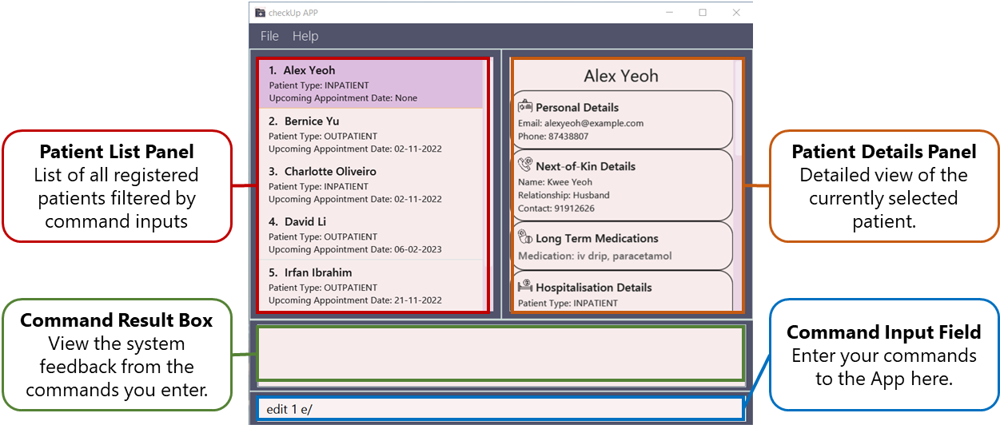
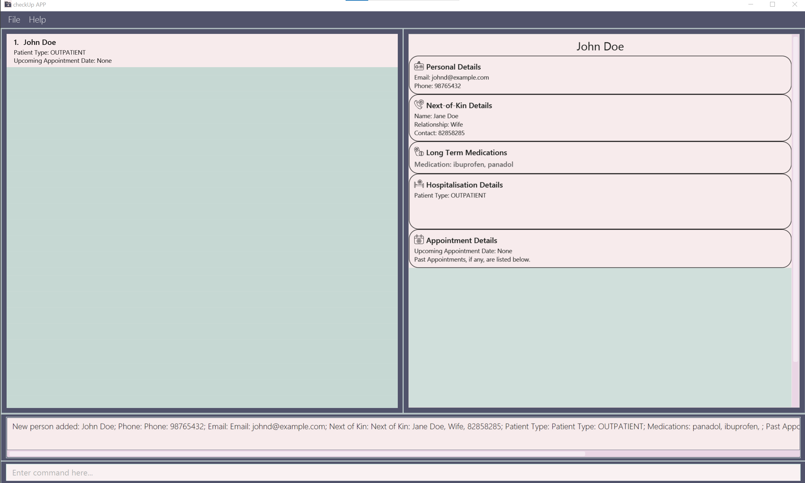
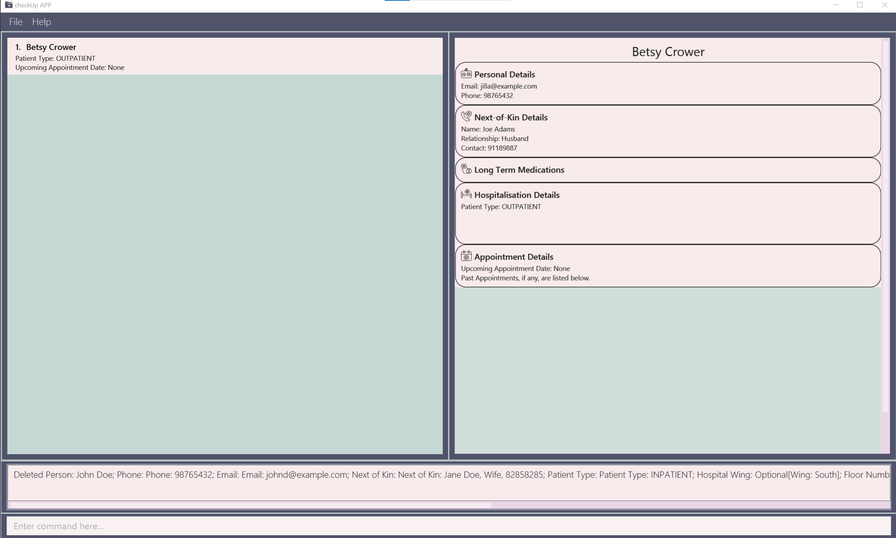
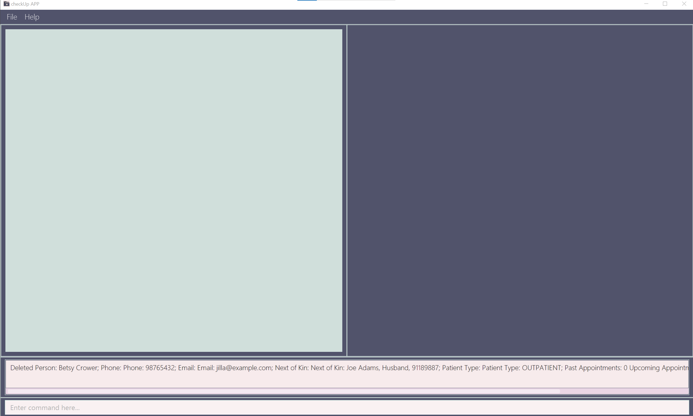
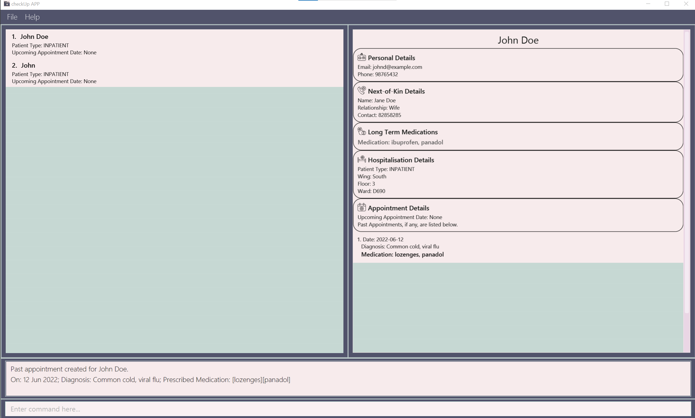
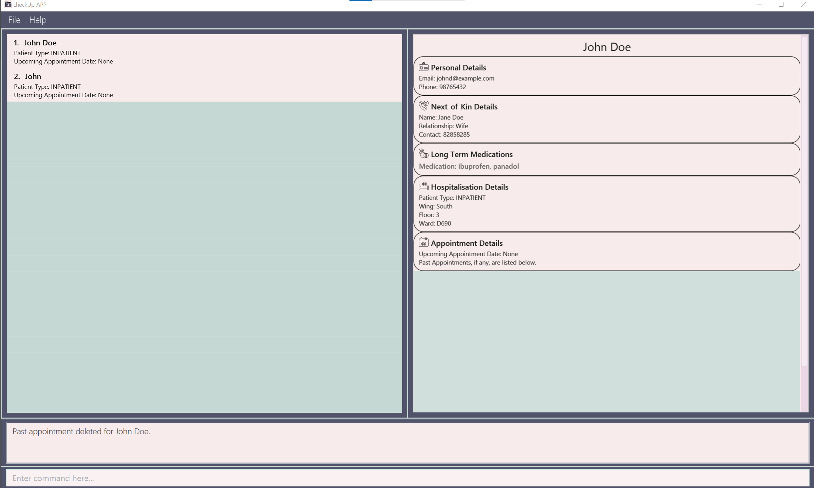
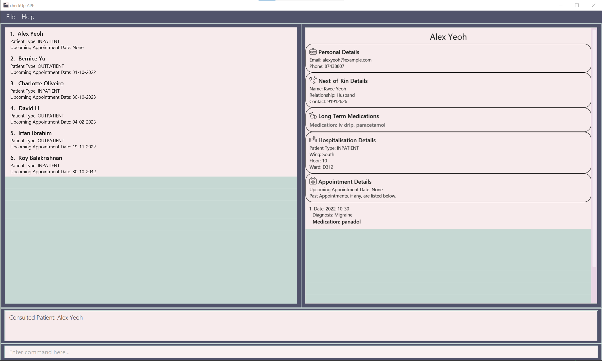

* Table of Contents
{:toc}
---

**checkUp is a desktop app for managing patient details**, optimized for use via a Command Line Interface (CLI) 
while still having the benefits of a Graphical User Interface (GUI). If you can type fast, checkUp can get your patient 
management tasks done quicker than traditional GUI apps.

**checkUp** is an app made for healthcare establishments. It allows clinics to track relevant details for their patients and
hospitals to track details related to a patient's stay at the hospital. Without an internet connection, checkUp stores
patient details such as:
- patient name;
- next-of-kin details;
- phone number;
- email;
- medical history;
- upcoming appointments; and 
- past appointments.

Also, medication tags can be added to your patients to keep track of their long-term medication history.

:notebook: We store this data locally on your device. This means that you can benefit from extremely quick loading times!

--------------------------------------------------------------------------------------------------------------------

## Quick start

1. Ensure you have Java `11` or above installed in your computer. To check this, run `java --version` in your command
   line interface.

2. Download the latest `checkUp.jar` from [here](https://github.com/AY2223S1-CS2103T-W16-3/tp/releases).

3. Copy the file to the folder you want to use as the _home folder_ for your checkUp instance.

4. Navigate to the home folder with `cd PATH_TO_FOLDER` through your command line interface.

5. Run `java -jar checkUp.jar` to start the app. The GUI similar to the below image should appear after startup.

6. Note how the app contains some sample data. 
   

7. Type your desired command into the command box and press <Enter> to execute it. e.g. typing **`help`** and pressing
   <Enter> will open the help window. 
   Some example commands you can try:

    * **`add`**`n/Amy Toh p/98765432 e/johnd@example.com nok/Jane Doe, Wife, 82858285 pt/inpatient hw/south fn/3 wn/D690
      m/panadol m/ibuprofen` : Adds a contact named `Amy Toh` to checkUp. 

    * **`delete`** `3` : Deletes the 3rd contact shown in the current patient list panel.

    * **`get`** `/n Alex`: Retrieve contact's information based on the prefix you provided. In this case, patients
    with the name `Alex` will be displayed.

    * **`view`** `1` : Views the 1st contact shown in the current patient list panel by displaying it on the patient details panel.

8. Refer to the [Features](#features) below for details of each command.

---

## Glossary

| Term              | Definition                                                                                |
|-------------------|-------------------------------------------------------------------------------------------|
| **Appointment**   | An arrangement to consult the doctor at a particular date.                                |
| **Diagnosis**     | The identification of diseases by the examination of symptoms and signs.                  |                                                                                                                                                                                                                                                                                    |
| **Inpatient**     | A patient who stays in a hospital while under treatment.                                  |                                                                                                                                                                                                                                                                          |
| **Outpatient**    | A patient who goes to a hospital or clinic for treatment without staying there overnight. |
| **Hospital Wing** | The section of the hospital where the inpatient is in.                                    |
| **Floor Number**  | The floor where the inpatient is on.                                                      |
| **Medication**    | A drug or other form of medicine that is used to treat or prevent disease.                |
| **Next-Of-Kin**   | The patient's closest living relative.                                                    |
| **Ward Number**   | The ward where the inpatient is in.                                                       |

## Symbols

| Symbol        | Meaning                                 |
|---------------|-----------------------------------------|
| :bulb:        | Tip that may be useful to know.         |
| :notebook:    | Information that may be useful to know. |
| :exclamation: | Dangerous commands - use with care.     |
| `+`           | Required field.                         |
| `-`           | Optional field.                         |
| `*`           | Multiple inputs are allowed.            |

## Features

**:notebook: Notes about the command format:** 

* Words in `UPPER_CASE` are the parameters to be supplied by the user. 
  e.g. in `get /n NAME`, `NAME` is a parameter which can be used as `get /n John Doe`.

* Items in square brackets are optional. 
  e.g. `n/NAME [m/MEDICATION]` can be used as `n/John Doe m/Ibuprofen` or as `n/John Doe`.

* Items with `…`​ after them can be used multiple times including zero times. 
  e.g. `[m/MEDICATION]…​` can be used as ` ` (i.e. 0 times), `m/ibuprofen m/lozenges`, `m/ibuprofen` etc.

* Parameters can be in any order. 
  e.g. if the command specifies `n/NAME p/PHONE_NUMBER`, `p/PHONE_NUMBER n/NAME` is also acceptable.

* Extraneous parameters for commands that do not take in parameters (such as `help`, `list`, `exit` and `clear`) will be
  ignored. 
  e.g. if the command specifies `help 123`, it will be interpreted as `help`.

**The features of CheckUp can be split into 3 main categories:**

* [Creating Patient Info](#creating-patient-info)
* [Retrieving Patient Info](#retrieving-patient-info)
* [General Commands](#general-commands)

---
## Creating Patient Info

### Adding a patient: `add`

Adds a patient to checkUp.

Format: `add {Prefix}/{Parameter}…​`

<h4> The prefixes and their respective parameters are as follows: </h4>

| Status  | Prefix | Parameter                               | Restrictions                                                                 |
|---------|--------|-----------------------------------------|------------------------------------------------------------------------------|
| `+`     | n/     | NAME                                    | Alphanumeric characters and spaces only.                                     |
| `+`     | p/     | PHONE                                   | Numbers only and at least 3 digits.                                          |
| `+`     | e/     | EMAIL                                   | **local-part**@**domain**. See below for more information.                   |
| `+`     | nok/   | NEXT-OF-KIN_NAME, RELATIONSHIP, CONTACT | NAME & RELATIONSHIP: Alphabets and spaces only.  CONTACT: Numbers only.  |
| `+`     | pt/    | PATIENT_TYPE                            | Either `inpatient`/`i` or `outpatient`/`o`.                                  |
| `-`     | hw/    | HOSPITAL_WING                           | Either `north`, `south`, `east` or `west`.                                   |
| `-`     | fn/    | FLOOR_NUMBER                            | Positive integer only.                                                       |
| `-`     | wn/    | WARD_NUMBER                             | One uppercase alphabet followed by 3 digits only.                            |
| `-`     | ua/    | UPCOMING_APPOINTMENT                    | `dd-MM-yyyy` format only (i.e. `12-06-2022`).                                |
| `-` `*` | m/     | LONG_TERM_MEDICATION                    | Alphanumeric characters and spaces only.                                     |

* **local-part**: Alphanumeric characters and `+`, `_`, `.`, `-` only.
* **domain**: Consists of domain labels separated by `-` or `.`. Domain labels consist of alphanumeric characters only
  and each domain label must be present (i.e. `johndoe@yahoo-.gmail` is not allowed as the domain label after `yahoo`
  and before `gmail` is empty).

:bulb: **Tip:**
A patient can have any number of medications (including 0)!

:bulb: **Tip:**
If patient type is outpatient, user should not input the prefixes and any value for
hospital wing, floor number, and ward number. 

#### Upon Execution
If the command was successfully executed, you should see something similar to the image below in the Command Result Box:

If not, please follow the error message given and format above to enter the correct command.

<h4>Examples:</h4>

If patient type is inpatient:  
`add n/John Doe p/98765432 e/johnd@example.com nok/Jane Doe, Wife, 82858285 pt/inpatient hw/south fn/3 wn/D690 m/panadol
m/ibuprofen`

 

If patient type is outpatient:  
`add n/John Doe p/98765432 e/johnd@example.com nok/Jane Doe, Wife, 82858285 pt/outpatient m/panadol m/ibuprofen`

### Editing a patient: `edit`

Edits the details of the patient specified by the index number used in the patient list panel.

Format: `edit INDEX {Prefix}/{Parameter}...`

<h4> The prefixes and their respective parameters are as follows: </h4>

| Status  | Prefix | Parameter                               | Restrictions                                                                |
|---------|--------|-----------------------------------------|-----------------------------------------------------------------------------|
| `+`     |        | INDEX                                   | Positive integer only.                                                      |
| `-`     | n/     | NAME                                    | Alphanumeric characters and spaces only.                                    |
| `-`     | p/     | PHONE                                   | Numbers only and at least 3 digits.                                         |
| `-`     | e/     | EMAIL                                   | **local-part**@**domain**. See below for more information.                  |
| `-`     | nok/   | NEXT-OF-KIN_NAME, RELATIONSHIP, CONTACT | NAME & RELATIONSHIP: Alphabets and spaces only.  CONTACT: Numbers only. |
| `-`     | pt/    | PATIENT_TYPE                            | Either `inpatient`/`i` or `outpatient`/`o`.                                 |
| `-`     | hw/    | HOSPITAL_WING                           | Either `north`, `south`, `east` or `west`.                                  |
| `-`     | fn/    | FLOOR_NUMBER                            | Positive integer only.                                                      |
| `-`     | wn/    | WARD_NUMBER                             | One uppercase alphabet followed by 3 digits only.                           |
| `-`     | ua/    | UPCOMING_APPOINTMENT                    | `dd-MM-yyyy` format only (i.e. `12-06-2022`).                               |
| `-` `*` | m/     | LONG_TERM_MEDICATION                    | Alphanumeric characters and spaces only.                                    |

* **local-part**: Alphanumeric characters and `+`, `_`, `.`, `-` only.
* **domain**: Consists of domain labels separated by `-` or `.`. Domain labels consist of alphanumeric characters only 
  and each domain label must be present (i.e. `johndoe@yahoo-.gmail` is not allowed as the domain label after `yahoo` 
  and before `gmail` is empty).

* At least one of the optional fields must be provided.
* Existing values will be updated to the input values.
* When editing medication, the existing medication of the patient will be removed i.e. adding of medication is not
  cumulative.
* To remove all patient’s medications, just type `m/` without specifying any medication after it.
* To remove all upcoming appointments, just type `ua/` without specifying any date after it.

#### Upon Execution
If the command was successfully executed, you should see something similar to the image below in the Command Result Box:

If not, please follow the error message given and format above to enter the correct command.

<h4> Examples: </h4>
                                                                                                   
* `edit 1 p/91234567 e/johndoe@example.com` edits the phone number and email address of the 1st patient to be `91234567`
  and `johndoe@example.com` respectively.
  

* `edit 2 n/Betsy Crower m/` edits the name of the 2nd patient to be `Betsy Crower` and clears all existing medication.
  

### Deleting a patient : `delete`

:exclamation: **Caution:** Deleted patient records cannot be recovered.

Deletes the patient specified by the index number used in the patient list panel.

Format: `delete INDEX`

* The index **must be a positive integer** 1, 2, 3, …​

#### Upon Execution
If the command was successfully executed, you should see something similar to the image below in the Command Result Box:

If not, please follow the error message given and format above to enter the correct command.

<h4> Examples: </h4>

* `list` followed by `delete 2` deletes the 2nd patient in checkUp.

* `get /n Betsy` followed by `delete 1` deletes the 1st patient displayed in the patient list panel after the `get /n` 
  command.

### Creating past appointment for patient: `appt`

Creates a past appointment for the patient specified by the index number used in the patient list panel.

Format: `appt INDEX {Prefix}/{Parameter}...`

<h4> The prefixes and their respective parameters are as follows: </h4>

| Status  | Prefix | Parameter             | Restrictions                                  |
|---------|--------|-----------------------|-----------------------------------------------|
| `+`     |        | INDEX                 | Positive integer only.                        |
| `+`     | on/    | DATE                  | `dd-MM-yyyy` format only (i.e. `12-06-2022`). |
| `+`     | diag/  | DIAGNOSIS             | -                                             |
| `-` `*` | m/     | MEDICATION_PRESCRIBED | Alphanumeric characters and spaces only.      |

#### Upon Execution
If the command was successfully executed, you should see something similar to the image below in the Command Result Box:

If not, please follow the error message given and format above to enter the correct command.

<h4> Examples: </h4>

* `get /n John` displays `John Doe` at index 1 and `John` at index 2.
* Following this, `appt 1 on/12-06-2022 diag/Common cold, viral flu m/Panadol m/Lozenges` will create a past appointment
  for `John Doe`.

### Deleting past appointment for patient: `delappt`

:exclamation: **Caution:** Deleted past appointments cannot be recovered.  

Deletes the most recent past appointment of the patient specified by the index number used in the patient list panel.

Format: `delappt INDEX`

* The index **must be a positive integer**, eg. 1, 2, 3...

#### Upon Execution
If the command was successfully executed, you should see something similar to the image below in the Command Result Box:

If not, please follow the error message given and format above to enter the correct command.

<h4> Examples: </h4>

* `get /n John` displays `John Doe` at index 1 and `John` at index 2.
* Following this, `delappt 1` will remove `John Doe`'s most recent past appointment.

### Consulting a patient: `consult`
Creates a past appointment for the patient on the current date. If the patient has an upcoming appointment for the current 
date, complete it and clear the upcoming appointment field.

Format: `consult INDEX {Prefix}/{Parameter}...`

<h4> The prefixes and their respective parameters are as follows: </h4>

| Status  | Prefix | Parameter             | Restrictions                                  |
|---------|--------|-----------------------|-----------------------------------------------|
| `+`     |        | INDEX                 | Positive integer only.                        |
| `+`     | diag/  | DIAGNOSIS             | -                                             |
| `-` `*` | m/     | MEDICATION_PRESCRIBED | Alphanumeric characters and spaces only.      |

#### Upon Execution
If the command was successfully executed, you should see something similar to the image below in the Command Result Box:

If not, please follow the error message given and format above to enter the correct command.

<h4> Examples: </h4>

* Assume `Alex Yeoh` is currently the first displayed person.
* `consult 1 diag/Migraine m/Panadol` will create a past appointment for `Alex Yeoh` for the current date and also 
clear his upcoming appointment which was scheduled for the current date.
  

---
## Retrieving Patient Info

### Listing all patients: `list`

Lists all the patients in checkUp.

Format: `list`

* This command resets any filters applied via the `get` command below.

### Locating patients: `get`
Finds patients based on the filters and keywords you input.

Format `get /PREDICATE [KEYWORDS]`

<h4> The filters you can use to get the patients by are as follows: </h4>

#### by name: `/n`

Finds patients whose names contain any of the given keywords.

Format: `get /n NAME`

* The search is case-insensitive. e.g. `get /n hans` matches `get /n Hans`.
* The order of the keywords does not matter. e.g. `get /n Hans Bo` matches `get /n Bo Hans`.
* Only full words will be matched e.g. `get /n Han` will not match `get /n Hans`.
* Patients with names that match at least one keyword will be displayed. e.g. `get /n Hans Bo` will display
  `Hans Gruber` and `Bo Yang`.

<h4> Examples: </h4>

* `get /n john` displays `john` and `John Doe`.
* `get /n alex david` displays `Alex Yeoh`, `David Li`. 
  

#### by next-of-kin data: `/nok`

Finds next-of-kin data for patients matching the input `PATIENT_NAME`.

Format: `get /nok PATIENT_NAME`

* The search is case-insensitive. e.g. `get /nok hans` matches `get /nok Hans`.
* The order of the keywords does not matter. e.g. `get /nok Hans Bo` matches `get /nok Bo Hans`.
* Patients with names that match at least one keyword will have their next-of-kin details displayed. e.g.
  `get /nok Hans Bo` will display `Sarar, 12345678, Mom`.

#### by hospital wing: `/hw`

Finds all the patients in that particular hospital wing.

Format: `get /hw HOSPITAL_WING`

* `HOSPITAL_WING` only allows the following values: South, North, West, East.
* The search is case-insensitive. e.g `get /hw souTh` matches `get /hw South`.
* Only fully inputted values will be used. e.g. `get /hw South No` matches `get /hw south` as `No` does not match
  South, North, West or East.
* `get /hw south /hw north` matches `get /hw south north`.
* All the patients in that hospital wing will be displayed. e.g. `get /hw SOUTH` will display `John` `Peter` `Mary`.

#### by floor number: `/fn`

Finds all the patients in that particular floor number.

Format: `get /fn FLOOR_NUMBER`

* `FLOOR_NUMBER` only allows positive integers.
* All the patients in that floor number will be displayed. e.g. `get /fn 2` will display `John` `Peter` `Mary`.
* Multiple `FLOOR_NUMBER` can be inputted. e.g. `get /fn 1 3` will display all patients staying in the 1st and 3rd floor.
* `get /fn 1 /fn 3` matches `get /fn 1 3`.

#### by ward number: `/wn`

Finds all the patients in that particular ward number.

Format: `get /wn WARD_NUMBER`

* All the patients in that ward number will be displayed. e.g. `get /wn D12` will display `John` `Peter` `Mary`.
* Multiple `WARD_NUMBER` can be inputted. e.g. `get /wn D001 E301` will display all patients staying in the ward number
  D001 and E301.
* `get /wn D12 /wn E13` matches `get /wn D12 E13`.

#### by medication: `/m`

Finds all the patients by medication.

Format: `get /m MEDICATION`

Example:
* `get /m ibuprofen` displays `John` `Peter` `Mary`.

#### by patient type: `/inp` 

Finds all the inpatients in checkUp.

Format: `get /inp`

Example:
* `get /inp` displays `Alex`, `Charlotte` and `Roy`.

#### by patient type: `/outp`

Finds all the outpatients in checkUp.

Format: `get /outp`

Example:
* `get /outp` displays `Bernice`, `David` and `Irfan`.

#### by appointments: `/appt`

Finds all past appointments of a patient specified by the index number used in the patient list panel.

Format: `get /appt INDEX`

* The index **must be a positive integer** 1, 2, 3, …​

Example: `get /appt 3` will display  
`On: 12 Jun 2022; Diagnosis: Common viral flu; Prescribed Medication: [lozenges][panadol]`. 
`On: 01 Jan 2001; Diagnosis: headache, medicine given for 3 days; Prescribed Medication: [ibuprofen]`.

#### by appointment date: `/appton`

Finds all the patients that have an appointment on a particular date.

Format: `get /appton APPOINTMENT_DATE`

* `APPPOINTMENT_DATE` must be in `dd-MM-yyyy` format.
* The appointment date refers to date the patient has an appointment with the clinic or hospital.
* All the patients having appointments on that date will be displayed. e.g. `get /appton 12-12-2020` will display
  `John` `Peter` `Mary`.

#### Upon Execution
If the command was successfully executed, you should see something similar to the image below in the Command Result Box:

If not, please follow the error message given and format above to enter the correct command.

### Obtaining total patient count: `count`

Gets total number of patients. Also gets the total number of types of long-term medications prescribed to patients, and a breakdown of the number of patients
taking each type of medication.

Format: `count`

* The count will be a non-negative number (>= 0). e.g. `count` displays `452` when there are 452 patients noted within
  the hospital.
* If 32 of those patients are on long-term antidepressants, the count will also display
  `antidepressants: 32`.

---
## General Commands

### Viewing a Patient : `view`

Displays the details of a patient specified by the index number from the patient list panel.

Format: `view INDEX`

* The index **must be a positive integer** 1, 2, 3, …​
* Details are displayed on the patient details panel.

:bulb: **Tip:**
On startup, the patient details panel will always default to the first patient if present.
 
It will also automatically focus onto the most recent patient added or edited.
 
When the current person displayed on the patient details panel is removed, it defaults to viewing the first patient
in the patient list panel if present, and empty otherwise.

#### Upon Execution
If the command was successfully executed, you should see something similar to the image below in the Command Result Box:

If not, please follow the error message given and format above to enter the correct command.

### Clearing all entries : `clear`

:exclamation: **Caution:** Deleted patient records cannot be recovered.

Empties checkUp of all patients stored.

Format: `clear`

* All patients will be removed from storage.
* This command is **nuclear**, and cannot be reversed. It should only be executed when absolutely necessary.
* This command is provided for privacy reasons, or to start afresh.

### Open the Help Page : `help`

Opens the Help Window.

Format: `help`

### Exiting the program : `exit`

Exits checkUp.

Format: `exit`

* GUI settings (window height and width) are preserved during this process.

### Saving the data

checkUp has been created in such a manner that you do not need to manually save data. Simply executing commands saves
any data created or deleted from the application.

### Editing the data file

* checkUp stores data in the JSON format, improving readability and allowing for manually editing the data file.
* The data file can be found in `data/checkup.json` in the home folder where checkUp's `jar` file is stored.
* Care needs to be taken to follow data storage formats properly, or else the application will **reject** the data file.

### GUI Interaction

Although CheckUp is built as a Command Line Interface application, it also supports the following GUI interactions:

#### Person List Panel:

* Clicking on patients in the Patient List Panel will automatically open their info in the Patient Details Panel.

Example:

* Clicking on the first patient `Alex Yeoh` will display his details on the Patient View Panel.

#### Person Details Panel:

* Clicking on the fields in the Patient Details Panel will automatically prepare them for editing in the Command Input Box.

Example:

* If the patient is `Roy Balakrishnan`, clicking on his name will set the text in the Command Input Box to `edit 1 n/`.

### Keyboard Shortcuts

Similar to other CLI applications, CheckUp supports a few keyboard shortcuts:
  * Navigate past commands with the `UP` and `DOWN` arrow keys.
  * Clear the text currently in the command box with `Ctrl + Shift + C`.

--------------------------------------------------------------------------------------------------------------------

## FAQ

**Q**: How do I transfer my data to another Computer? 
**A**: Install the app in the other computer and overwrite the empty data file it creates with the file that contains
the data of your previous checkUp home folder.

--------------------------------------------------------------------------------------------------------------------

## Command summary

| Action                                                        | Format, Examples                                                                                                                                                                                                                                                                                                                                   |
|---------------------------------------------------------------|----------------------------------------------------------------------------------------------------------------------------------------------------------------------------------------------------------------------------------------------------------------------------------------------------------------------------------------------------|
| [**add**](#adding-a-patient-add)                              | `add n/NAME p/PHONE e/EMAIL nok/NEXT-OF-KIN_NAME, RELATIONSHIP, CONTACT pt/PATIENT_TYPE [hw/HOSPITAL_WING] [fn/FLOOR_NUMBER] [wn/WARD_NUMBER] [ua/UPCOMING_APPOINTMENT] [m/LONG_TERM_MEDICATION]…`  e.g., `add n/John Doe p/98765432 e/johnd@example.com nok/Jane Doe, Wife, 82858285 pt/inpatient hw/south fn/3 wn/D690 m/panadol m/ibuprofen` |                                                                                                                                                                                                                                                                          |
| [**edit**](#editing-a-patient-edit)                           | `edit INDEX [n/NAME] [p/PHONE] [e/EMAIL] [nok/NEXT-OF-KIN_NAME, RELATIONSHIP, CONTACT] [pt/PATIENT_TYPE] [hw/HOSPITAL_WING] [fn/FLOOR_NUMBER] [wn/WARD_NUMBER] [ua/UPCOMING_APPOINTMENT] [m/LONG_TERM_MEDICATION]...`  e.g.,`edit 2 n/James Lee e/jameslee@example.com`                                                                         |
| [**delete**](#deleting-a-patient-delete)                      | `delete INDEX`  e.g., `delete 3`                                                                                                                                                                                                                                                                                                                |
| [**appt**](#creating-past-appointment-for-patient-appt)       | `appt INDEX on/DATE diag/DIAGNOSIS [m/MEDICATION]...`   e.g., `appt 1 on/12-06-2022 diag/Common cold, viral flu m/panadol m/lozenges`                                                                                                                                                                                                           |                                                                                                                                                                                                                                                                                    |
| [**delappt**](#deleting-past-appointment-for-patient-delappt) | `delappt INDEX`   e.g., `delappt 1`                                                                                                                                                                                                                                                                                                             |
| [**list**](#listing-all-patients-list)                        | `list`                                                                                                                                                                                                                                                                                                                                             |
| [**get /n**](#by-name-n)                                      | `get /n NAME`  e.g., `get /n John`                                                                                                                                                                                                                                                                                                              |
| [**get /nok**](#by-next-of-kin-data-nok)                      | `get /nok PATIENT_NAME`  e.g., `get /nok John`                                                                                                                                                                                                                                                                                                  |
| [**get /hw**](#by-hospital-wing-hw)                           | `get /hw HOSPITAL_WING`  e.g., `get /hw South`                                                                                                                                                                                                                                                                                                  |
| [**get /fn**](#by-floor-number-fn)                            | `get /fn FLOOR_NUMBER`   e.g., `get /fn 2`                                                                                                                                                                                                                                                                                                      |
| [**get /wn**](#by-ward-number-wn)                             | `get /wn WARD_NUMBER`   e.g., `get /wn D012`                                                                                                                                                                                                                                                                                                    |
| [**get /inp**](#by-patient-type-inp)                          | `get /inp`                                                                                                                                                                                                                                                                                                                                         |
| [**get /outp**](#by-patient-type-outp)                        | `get /outp`                                                                                                                                                                                                                                                                                                                                        |
| [**get /m**](#by-medication-m)                                | `get /m MEDICATION`   e.g., `get /m ibuprofen`                                                                                                                                                                                                                                                                                                  |
| [**get /appt**](#by-appointments-appt)                        | `get /appt INDEX`   e.g., `get /appt 3`                                                                                                                                                                                                                                                                                                         |
| [**get /appton**](#by-appointment-date-appton)                | `get /appton APPOINTMENT_DATE`   e.g., `get /appton 21-05-2020`                                                                                                                                                                                                                                                                                 |
| [**count**](#obtaining-total-patient-count-count)             | `count`                                                                                                                                                                                                                                                                                                                                            |
| [**view**](#viewing-a-patient-view)                           | `view INDEX`   e.g., `view 1`                                                                                                                                                                                                                                                                                                                   |
| [**clear**](#clearing-all-entries--clear)                     | `clear`                                                                                                                                                                                                                                                                                                                                            |
| [**help**](#open-the-help-page--help)                         | `help`                                                                                                                                                                                                                                                                                                                                             |
| [**exit**](#exiting-the-program--exit)                        | `exit`                                                                                                                                                                                                                                                                                                                                             |
